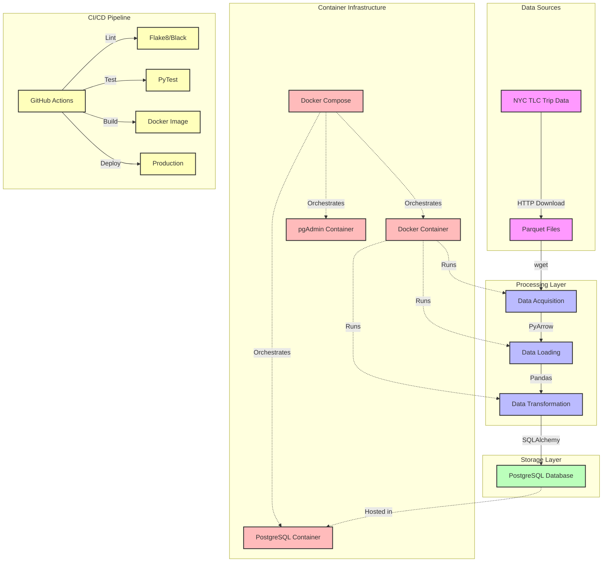

# 🚕 NYC Taxi Data Pipeline

<div align="center">


[](https://github.com/yourusername/first_tryout/actions)
[](https://www.python.org/)
[](https://python-poetry.org/)
[](https://www.docker.com/)
[](https://opensource.org/licenses/MIT)
[](https://github.com/psf/black)

*A modern data pipeline that processes NYC taxi trip data, providing valuable insights through seamless ETL operations*

</div>

## ✨ Features

<div align="center">
<table>
<tr>
<td width="50%">
📊 **Data Acquisition**
- Automatic download of NYC taxi trip data
- Processes parquet files efficiently
- Robust error handling
- Progress tracking

</td>
<td width="50%">

🔄 **Data Processing**
- PyArrow for high-performance processing
- Pandas for data manipulation
- Flexible data transformations
- Memory-efficient operations

</td>
</tr>
<tr>
<td width="50%">

💾 **Data Storage**
- PostgreSQL database integration
- Optimized data loading
- Atomic transactions
- Data versioning support

</td>
<td width="50%">

🔧 **Development**
- Poetry for dependency management
- Pre-commit hooks for code quality
- CI/CD pipeline with GitHub Actions
- Docker-based deployment

</td>
</tr>
</table>
</div>

## 🚀 Quick Start

### Prerequisites

- Docker and Docker Compose
- Python 3.10+
- Poetry (for development)

### Run with Docker

```bash
# Clone the repository
git clone https://github.com/Sty-ven/first_tryout.git
cd first_tryout

# Start the pipeline
docker-compose up
```

### Development Setup

```bash
# Install dependencies
poetry install

# Setup pre-commit hooks
poetry run pre-commit install

# Run tests
poetry run pytest
```

## 📊 Architecture

<div align="center">



</div>

## 🏗️ Project Structure

```
├── .github/workflows  # CI/CD pipeline configuration
├── tests/             # Test suite
├── Dockerfile         # Container definition
├── critical.py        # Main data pipeline script
├── docker-compose.yml # Container orchestration
├── pyproject.toml     # Poetry configuration
└── README.md          # This documentation
```

## 🧪 Testing

```bash
# Run tests
poetry run pytest

# Format code
poetry run black .

# Lint code
poetry run flake8
```

## 🔄 CI/CD Pipeline

This project uses GitHub Actions for continuous integration and deployment:

1. **Lint & Test**: Validates code quality and functionality
2. **Build**: Packages the application into a Docker image
3. **Deploy**: Pushes to container registry and deploys to production

## 📜 License

This project is licensed under the MIT License - see the LICENSE file for details.

## 🙏 Acknowledgements

- [NYC TLC](https://www1.nyc.gov/site/tlc/about/tlc-trip-record-data.page) for providing the data
- [PyArrow](https://arrow.apache.org/docs/python/) for efficient data processing
- [Pandas](https://pandas.pydata.org/) for data manipulation tools
- [PostgreSQL](https://www.postgresql.org/) for reliable data storage

---

<div align="center">
<p>Made with ❤️ by <a href="https://github.com/yourusername">Your Name</a></p>
</div>